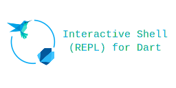

# Interactive shell (REPL) for Dart
## Introduction



Run it (temporary solution, will refactor later): Inside `packages/interactive`, execute `dart run --enable-vm-service bin/interactive.dart`.

## Feature details

### Expressions

```dart
>>> a = 'Hello'; b = ' world!'; 
>>> '$a, $b'                   
Hello,  world!
```

### Statements

```dart
>>> print(a)
Hello
```

<small>(All methods, not only `print`)</small>

### Functions

#### Define and redefine

```dart
>>> String f() => 'old';
>>> f()
old
>>> String f() => 'new';
>>> f()
new
```

#### Use local and global variables

```dart
>>> a = 10;
>>> int f() { int b = 20; a++; b++; return a+b; }
>>> f() 
32
>>> f()
33
```

### Classes

#### Define and redefine, preserving states

```dart
>>> class C { int a = 10; int f() => a * 2; }
>>> c = C(); print(c.f());
20
>>> class C { int a = 1000; int f() => a * 3; }
>>> c.f()
30
```

<small>Remark: This follows the Dart hot reload semantics.</small>

#### Extends and implements

```dart
>>> class A { int f() => 10; } class B extends A { int f() => 20; }
>>> A().f() + B().f()
30
>>> class B implements A { int f() => 30; }
>>> A().f() + B().f()
40
```

#### Use local variables, fields, and global variables

```dart
>>> a = 10;
>>> class C { int b = 20; int f() { int c = 30; a++; b++; c++; return a+b+c; } }
>>> c = C(); print(c.f()); print(c.f());
63
65
```

### Add libraries as dependency

Use `!dart pub add package_name`, just like what is done in Python (Jupyter/IPython).

```dart
>>> join('directory', 'file.txt')
(...error, since have not added that dependency...)
>>> !dart pub add path
Resolving dependencies...

+ path 1.8.2

Changed 1 dependency!

>>> join('directory', 'file.txt')
(...error, since have imported it...)
>>> import 'package:path/path.dart';
>>> join('directory', 'file.txt')   
directory/file.txt
```

### Imports

#### Built-in package

```dart
>>> Random().nextInt(100)
(some error outputs here, because it is not imported)
>>> import "dart:math";
>>> Random().nextInt(100)
9
```

#### Third party package

Note: If it has not been added to dependency, please follow instructions above and use `!dart pub add path` to add it.

```dart
>>> join('directory', 'file.txt')
(...error, since have imported it...)
>>> import 'package:path/path.dart';
>>> join('directory', 'file.txt')   
directory/file.txt
```

### Multiple in one go

```dart
>>> int g() => 42; class C { int a = 10; int f() => a * 2; }
>>> C().f() + g()
62
```

### Multi line if not ended

(The `...`, instead of `>>>`, appears in the two lines, because the package detects it is not finished.)

```dart
>>> class C {
...   int a = 10;
... }
>>> 
```

### Run commands

Use prefix `!`.

```dart
>>> !whoami
tom
>>> !date
2022-10-22 ...outputs...
```

## ✨ Contributors

<!-- ALL-CONTRIBUTORS-BADGE:START - Do not remove or modify this section -->
[](#contributors-)
<!-- ALL-CONTRIBUTORS-BADGE:END -->

Thanks goes to these wonderful people ([emoji key](https://allcontributors.org/docs/en/emoji-key)):

<!-- ALL-CONTRIBUTORS-LIST:START - Do not remove or modify this section -->
<!-- prettier-ignore-start -->
<!-- markdownlint-disable -->
<table>
  <tbody>
    <tr>
      <td align="center"><a href="https://github.com/fzyzcjy"><br /><sub><b>fzyzcjy</b></sub></a><br /><a href="https://github.com/fzyzcjy/dart_interactive/commits?author=fzyzcjy" title="Code">💻</a> <a href="https://github.com/fzyzcjy/dart_interactive/commits?author=fzyzcjy" title="Documentation">📖</a> <a href="#ideas-fzyzcjy" title="Ideas, Planning, & Feedback">🤔</a></td>
      <td align="center"><a href="http://mrale.ph"><br /><sub><b>Vyacheslav Egorov</b></sub></a><br /><a href="#ideas-mraleph" title="Ideas, Planning, & Feedback">🤔</a></td>
      <td align="center"><a href="http://blackhc.net"><br /><sub><b>Andreas Kirsch</b></sub></a><br /><a href="#ideas-BlackHC" title="Ideas, Planning, & Feedback">🤔</a></td>
      <td align="center"><a href="http://manichord.com/blog"><br /><sub><b>Maksim Lin</b></sub></a><br /><a href="#ideas-maks" title="Ideas, Planning, & Feedback">🤔</a></td>
    </tr>
  </tbody>
</table>

<!-- markdownlint-restore -->
<!-- prettier-ignore-end -->

<!-- ALL-CONTRIBUTORS-LIST:END -->

More specifically, thanks for all these contributions:

* TODO
